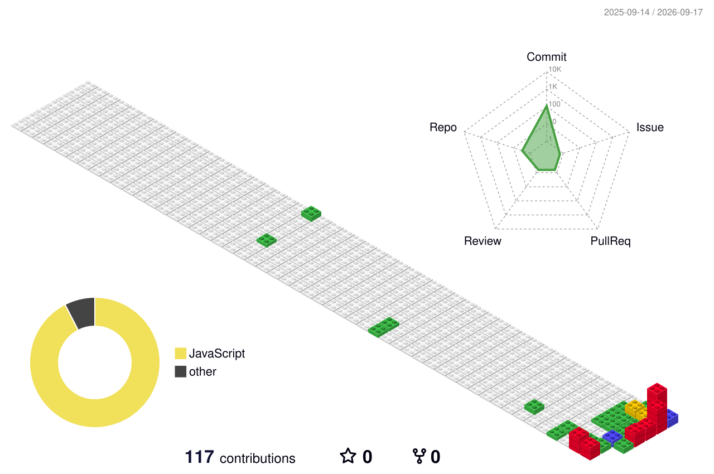

# Hi, I'm Ram Chouhan (SageGallant) 👋
### Full-Stack Developer • WebRTC & Real-Time Media Architect • Open-Source Builder

 

---

### 🎬 Featured Project: MovieNight

  

**[MovieNight](https://github.com/sagegallant/movienight)** — A 100% private, serverless P2P virtual screening room and watch party platform in your browser.

- 💎 **1080p Full HD WebRTC Pipeline**: Custom RFC 4566 SDP bandwidth munging up to 12 Mbps.
- ⏱️ **Sub-Second Drift Correction**: Authoritative clock heartbeats and late-join transit recovery.
- 🍿 **Interactive Cinema Stage**: Responsive 16:9 theater, webcam overlay grid, live emoji reactions, and Backrow chat.
- 🔗 **[Try the Live Screening Room](https://sagegallant.github.io/movienight/)** • **[Explore the Code](https://github.com/sagegallant/movienight)**

---

### 🛠️ Tech Stack & Tools

---

### 📊 GitHub Activity & Statistics

 

---

  ⭐ If you find MovieNight or any of my work useful, feel free to drop a star!

